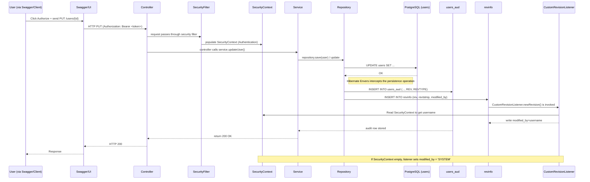

# Kiến trúc Backend: Audit Logging với Hibernate Envers

## 1. Bản chất cốt lõi (Góc nhìn Architect)

### 1.1. Tại sao JPA Auditing (Giai đoạn 1) là chưa đủ?
Ở Giai đoạn 1, ta đã cài đặt JPA Auditing để có 2 cột `created_at` và `updated_at`.
* **Tình huống:** Một nhân viên (User A) có Role là `USER`. Đêm qua, ai đó đã đổi Role của A thành `ADMIN`. Sáng nay sếp phát hiện và hỏi: *"Ai đã cấp quyền ADMIN cho A? Cấp lúc mấy giờ? Trước đó nó đang có quyền gì?"*
* **Bất lực:** Nhìn vào Database, ta chỉ thấy `updated_at` là 2h sáng. Chấm hết! Ta không biết giá trị cũ là gì, cũng không biết tài khoản nào đã thực hiện lệnh UPDATE đó. Dấu vết đã bị ghi đè hoàn toàn.

### 1.2. Giải pháp: Audit Logging (Lịch sử phiên bản)
Audit Logging là kỹ thuật lưu lại **toàn bộ các phiên bản (Revisions)** của một dòng dữ liệu theo thời gian, giống như lịch sử chỉnh sửa (Version History) trên Google Docs.
Có 3 cách để làm Audit Logging:
1. **Viết code tay (Dùng AOP hoặc Trigger dưới DB):** Rất cực, dễ lỗi, phình to code logic.
2. **Change Data Capture (CDC) với Debezium + Kafka:** Đỉnh cao của Microservices, nhưng quá phức tạp cho Monolith.
3. **Hibernate Envers:** Giải pháp hoàn hảo, chuẩn mực, native với Spring Boot. Chỉ cần gắn 1 Annotation, nó tự lo 100% việc lưu trữ.

### 1.3. Hibernate Envers hoạt động như thế nào?
Khi bạn gắn bùa chú `@Audited` lên bảng `users`, Envers sẽ làm 2 việc:
1. Nó yêu cầu phải có một bảng bóng ma (Shadow Table) tên là `users_aud` (chứa các cột y hệt bảng `users`, cộng thêm cột `REV` (mã phiên bản) và `REVTYPE` (0: Thêm mới, 1: Cập nhật, 2: Xóa)).
2. Nó yêu cầu một bảng trung tâm tên là `revinfo` để lưu thông tin về cái "Phiên bản" đó (Sinh ra lúc nào? BỞI AI?).
* 👉 Mọi lệnh `save()`, `update()`, `delete()` vào `users` giờ đây sẽ tự động phát sinh thêm 1 lệnh `INSERT` âm thầm vào bảng `users_aud`.



---

## 2. Hướng dẫn Implement vào dự án Spring Boot

Chúng ta sẽ cài đặt Envers để theo dõi mọi sự thay đổi trên bảng `users` và tự động lấy `username` của người đang đăng nhập (từ JWT Token) để ghi vào lịch sử.

### Bước 1: Khai báo thư viện (pom.xml)
Thêm dependency của Spring Data Envers (Nó đã bao gồm sẵn Hibernate Envers):

```xml
<dependency>
    <groupId>org.springframework.data</groupId>
    <artifactId>spring-data-envers</artifactId>
</dependency>
```

(Nhớ reload Maven).

### Bước 2: Chuẩn bị Database với Flyway (QUAN TRỌNG)
Vì chúng ta đã khóa quyền tự tạo bảng của Hibernate (ddl-auto: validate), ta phải tự tay tạo các bảng Audit bằng Flyway.
Tạo file `V3__audit_tables.sql` trong `db/migration`:

```sql
-- 1. Bảng cấu hình Phiên bản (Lưu thông tin chung của mỗi lần có thay đổi)
CREATE SEQUENCE revinfo_seq START WITH 1 INCREMENT BY 50;

CREATE TABLE revinfo (
    rev INTEGER NOT NULL,
    revtstmp BIGINT,
    -- CỘT CUSTOM THÊM VÀO ĐỂ LƯU AI LÀ NGƯỜI SỬA
    modified_by VARCHAR(255), 
    PRIMARY KEY (rev)
);

-- 2. Bảng Bóng ma của Users (Lưu lịch sử bảng users)
CREATE TABLE users_aud (
    id VARCHAR(255) NOT NULL,
    rev INTEGER NOT NULL,
    revtype SMALLINT,
    -- Các cột copy từ bảng users sang (KHÔNG set UNIQUE hay NOT NULL ngoài PK)
    username VARCHAR(255),
    password VARCHAR(255),
    firstname VARCHAR(255),
    lastname VARCHAR(255),
    dob DATE,
    created_at TIMESTAMP,
    updated_at TIMESTAMP,
    PRIMARY KEY (id, rev),
    CONSTRAINT fk_users_aud_revinfo FOREIGN KEY (rev) REFERENCES revinfo (rev)
);
```

### Bước 3: Viết logic lấy thông tin "Kẻ thay đổi" (Who did it?)
Hibernate không biết hệ thống Security của bạn là gì. Bạn phải dạy nó cách móc JWT Token ra để lấy username.

Tạo thư mục `audit` bên trong `com.bill.identity_service` và tạo 2 file:

File 1: `CustomRevisionEntity.java` (Ánh xạ bảng `revinfo` vào code)

```java
package com.bill.identity_service.audit;

import jakarta.persistence.*;
import lombok.Getter;
import lombok.Setter;
import org.hibernate.envers.RevisionEntity;
import org.hibernate.envers.RevisionNumber;
import org.hibernate.envers.RevisionTimestamp;

@Entity
@Table(name = "revinfo")
@RevisionEntity(CustomRevisionListener.class) // Đăng ký Listener
@Getter
@Setter
public class CustomRevisionEntity {
    
    @Id
    @GeneratedValue(strategy = GenerationType.SEQUENCE, generator = "revinfo_seq")
    @SequenceGenerator(name = "revinfo_seq", sequenceName = "revinfo_seq", allocationSize = 50)
    @RevisionNumber
    private int rev;

    @RevisionTimestamp
    private long revtstmp;

    // Trường lưu Username của người thao tác
    @Column(name = "modified_by")
    private String modifiedBy;
}
```

File 2: `CustomRevisionListener.java` (Kẻ đứng rình lấy Token)

```java
package com.bill.identity_service.audit;

import org.hibernate.envers.RevisionListener;
import org.springframework.security.core.Authentication;
import org.springframework.security.core.context.SecurityContextHolder;

public class CustomRevisionListener implements RevisionListener {

    @Override
    public void newRevision(Object revisionEntity) {
        CustomRevisionEntity customRevisionEntity = (CustomRevisionEntity) revisionEntity;
        
        // Mặc định là System (nếu thao tác không đi qua API có Token)
        String username = "SYSTEM"; 
        
        // Lôi cái hộp chứa Security ra kiểm tra
        Authentication authentication = SecurityContextHolder.getContext().getAuthentication();
        
        if (authentication != null && authentication.isAuthenticated() && !authentication.getName().equals("anonymousUser")) {
            username = authentication.getName(); // Lấy username từ JWT Token
        }
        
        customRevisionEntity.setModifiedBy(username);
    }
}
```

### Bước 4: Đặt máy quay lén (`@Audited`)
Mở file Entity `User.java` của bạn ra và thêm duy nhất 1 Annotation của Envers vào đầu class:

```java
import org.hibernate.envers.Audited; // Import đúng gói này nhé

@Entity
@Data
// ...
@Table(name = "users")
@Audited // <--- "BÙA CHÚ" AUDIT LOG NẰM Ở ĐÂY
public class User extends BaseEntity {
   // ...
}
```

(Nếu nó báo lỗi liên quan đến `BaseEntity`, hãy thêm `@Audited` vào cả class `BaseEntity.java` nữa để nó theo dõi luôn ngày tháng).

## 3. Best Practices (Tư duy của Architect)
Không Audit mọi thứ: Chỉ gắn `@Audited` vào các bảng quan trọng (User, Role, Permission, Order, Transaction). Đừng gắn vào các bảng Log, Token, Session... vì nó sẽ làm DB phình to một cách vô ích.

Tách Database (Advanced): Ở các hệ thống siêu lớn, người ta thường chép các bảng `_aud` ra hẳn một Database riêng biệt để tránh làm chậm DB chính lúc lấy báo cáo.

---

### 🎯 NHIỆM VỤ THỰC CHIẾN CỦA BẠN:

Bạn hãy làm theo đúng 4 bước trong tài liệu trên.

**Cách test thành quả (Phải làm đúng trình tự):**
1. Khởi động lại Spring Boot (Để Flyway chạy file `V3` tạo bảng `revinfo` và `users_aud`).
2. Mở Swagger lên. Dùng API `POST /auth/token` lấy Token của tài khoản `admin` (Hoặc tài khoản nào bạn đang có).
3. Ấn nút **Authorize** ở góc phải trên Swagger, nhập Bearer Token vào.
4. Gọi API `PUT` sửa thông tin của 1 User bất kỳ (Ví dụ: Đổi tên). 
   *(Nếu bạn chưa có API Update User, hãy gọi tạm API tạo mới User `POST /users` cũng được).*
5. **Đỉnh cao là ở đây:** Mở Database của bạn lên (DBeaver/pgAdmin). 
   * `SELECT * FROM revinfo;` -> Bạn sẽ thấy username (admin) đang thao tác.
   * `SELECT * FROM users_aud;` -> Bạn sẽ thấy dữ liệu của cái thằng User bị sửa/tạo, kèm theo cột `REVTYPE` (0 là tạo mới, 1 là Update).

