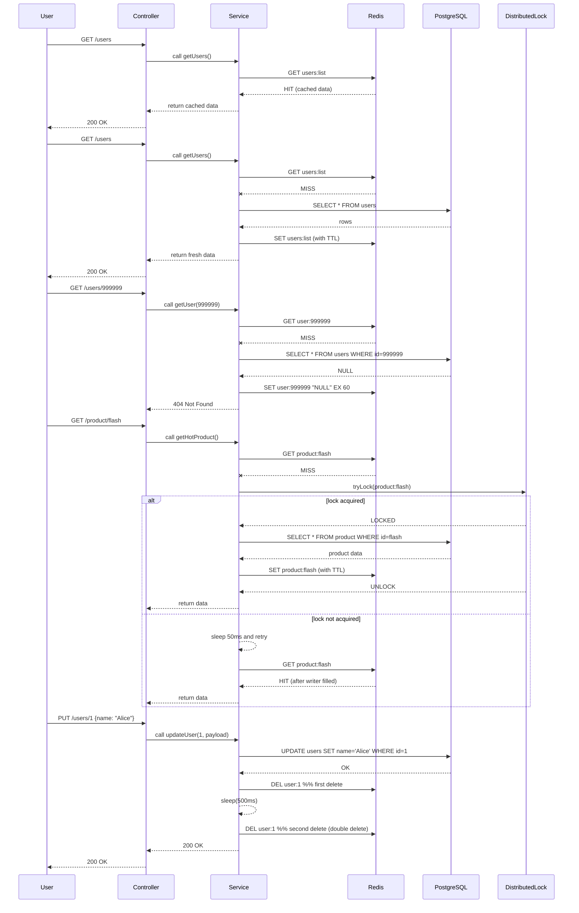

# Kiến trúc Backend: Optimizing với Redis & Caching

## 1. Bản chất cốt lõi (Góc nhìn Architect)

### 1.1. Vấn đề của Database truyền thống (PostgreSQL)

Mỗi lần user gọi API `GET /users`, Spring Boot sẽ tạo một câu lệnh SQL, gửi xuống PostgreSQL. PostgreSQL phải lôi dữ liệu từ Ổ cứng (Disk) lên, xử lý rồi trả về.

Ổ cứng đọc rất chậm.

Nếu có 1000 request/giây gọi vào DB, DB sẽ bị quá tải (quá giới hạn kết nối), CPU của DB server tăng vọt lên 100% và sập.

### 1.2. Giải pháp: Caching (Bộ nhớ đệm) với Redis

Redis là một cơ sở dữ liệu lưu trữ trực tiếp trên RAM (In-memory). Tốc độ đọc/ghi trên RAM nhanh hơn Ổ cứng hàng chục nghìn lần.

Flow hoạt động khi có Redis:

User A gọi GET /users.

Hệ thống kiểm tra xem trong Redis đã có danh sách users chưa?

Trạng thái Cache Miss (Chưa có): Hệ thống chọc xuống PostgreSQL lấy dữ liệu (chậm). Trả về cho User A, đồng thời lưu bản sao đó vào Redis.

User B, C, D gọi GET /users.

Trạng thái Cache Hit (Đã có): Hệ thống lấy thẳng dữ liệu từ Redis trả về luôn (tốc độ vài mili-giây) -> Không ai chạm vào PostgreSQL nữa -> PostgreSQL được giải cứu.

## Diagram luồng hoạt động (Mermaid sequence diagram)

Dưới đây là sơ đồ tuần tự (sequence diagram) bằng Mermaid mô tả các luồng chính khi dùng Redis: Cache Hit, Cache Miss (Cache-Aside), Cache Penetration (cache null), Cache Breakdown (distributed lock) và flow khi ghi dữ liệu (delete cache + delay double delete).



### 1.3. Khi nào DÙNG và KHÔNG NÊN DÙNG?

✅ Nên dùng: Những dữ liệu đọc nhiều, ít bị sửa. Trong hệ thống identify-service của bạn, Role và Permission là 2 ứng cử viên hoàn hảo. (Mỗi lần xác thực token, bạn phải check Role/Permission, gọi API liên tục nhưng cả năm trời mới tạo Permission mới 1 lần).

❌ Không nên dùng: Những dữ liệu thay đổi liên tục theo realtime (ví dụ: Số dư tài khoản ngân hàng, giá chứng khoán). Nếu lấy từ Cache có thể bị sai lệch dữ liệu cũ.

### 1.4. Vấn đề đau đầu nhất của Cache: Cache Invalidation (Xóa rác)

Thử tưởng tượng: Bạn đã cache danh sách User vào Redis. Hôm sau, một ông Admin vào đổi tên một user dưới Database.
Lúc này: Dữ liệu trong Database đã mới, nhưng dữ liệu trong Redis vẫn là cũ.
👉 Nếu không có chiến lược xóa cache (Evict) khi update/delete, Front-end sẽ mãi mãi nhìn thấy dữ liệu cũ.

## 2. Fit vào hệ thống của bạn

Vị trí đứng: Redis sẽ nằm ở tầng Service. Khi Controller gọi Service, Service sẽ quyết định lấy từ Redis hay lấy từ Repository.

Tác động: Chúng ta sẽ không cần phải viết code logic kết nối Redis lằng nhằng. Spring Boot có cung cấp sẵn các Annotation như `@Cacheable`, `@CachePut`, `@CacheEvict` để biến mọi thứ thành "phép thuật" chỉ với 1 dòng code.

## 3. Khởi động thực hành: Setup Môi trường

Để code được phần này, máy tính của bạn cần phải có một con server Redis đang chạy. Cách chuyên nghiệp nhất mà các Senior hay dùng là dùng Docker.

Bước 1: Khởi chạy Redis bằng Docker (Nếu bạn đã cài Docker)
Mở Terminal/CMD lên và gõ lệnh sau:

```bash
docker run -d --name my-redis -p 6379:6379 redis
```

Giải thích: Lệnh này tải Redis về và chạy ngầm (port mặc định là 6379).

(Nếu bạn chưa cài Docker, bạn có thể tải Redis cho Windows và chạy file .exe, hoặc báo tôi để tôi hướng dẫn chi tiết nhé).

Bước 2: Thêm thư viện vào Spring Boot
Mở file `pom.xml` của project và thêm dependency này vào:

```xml
		<dependency>
			<groupId>org.springframework.boot</groupId>
			<artifactId>spring-boot-starter-data-redis</artifactId>
		</dependency>
```

(Nhớ reload lại Maven nhé).

Bước 3: Cấu hình kết nối trong `application-prod.yaml`
Bạn thêm cấu hình redis vào khối `spring` (ngang hàng với datasource):

```yaml
spring:
  # ... các config cũ ...
  data:
	redis:
	  host: localhost
	  port: 6379
```

# Kiến trúc Backend: Deep Dive Redis - Use Cases & Cạm bẫy thực chiến

## 1. Bản chất cốt lõi: Tại sao Redis lại nhanh "đột biến"?

Redis (Remote Dictionary Server) là một database lưu trữ dữ liệu dưới dạng **Key-Value** và chạy hoàn toàn trên **RAM (In-memory)**.
* **Tốc độ:** Tốc độ đọc/ghi của RAM đo bằng *nanoseconds*, trong khi Ổ cứng (SSD/HDD) đo bằng *milliseconds*. Redis có thể xử lý hàng trăm nghìn (thậm chí hàng triệu) request mỗi giây.
* **Đơn luồng (Single-threaded):** Redis xử lý các lệnh tuần tự từng cái một trên một luồng duy nhất. Điều này giúp loại bỏ hoàn toàn các rủi ro về Race-condition (xung đột dữ liệu đa luồng) và chi phí Context-Switching của CPU. Tuy đơn luồng nhưng nhờ lưu trên RAM, nó vẫn cực kỳ nhanh.

---

## 2. Các Use-case "Kinh điển" của Redis (Không chỉ là Caching)

### 2.1. Caching (Bộ nhớ đệm) - Use case phổ biến nhất
Lưu lại các kết quả từ Database (PostgreSQL) hoặc kết quả tính toán tốn thời gian để dùng lại.
* **Trong dự án của bạn:** Các API như `GET /roles`, `GET /permissions` hoặc lấy thông tin User Profile cực kỳ phù hợp để cache vì ít khi thay đổi nhưng lại được gọi liên tục.

### 2.2. Quản lý Session phân tán (Distributed Session)
Khi hệ thống scale lên nhiều server (Microservices), nếu User đăng nhập ở Server A (lưu session ở RAM của Server A), lúc gọi API bị load-balancer đẩy sang Server B sẽ bị bắt đăng nhập lại.
* **Giải pháp:** Bắn toàn bộ Session (hoặc Token) vào Redis. Mọi Server đều chọc vào Redis để kiểm tra -> Đăng nhập 1 lần, dùng mọi nơi.

### 2.3. Blacklist Token (Dự án của bạn đang rất cần cái này)
Hiện tại bạn đang lưu `InvalidatedToken` (Token đăng xuất) xuống PostgreSQL. 
* **Vấn đề:** Mỗi lần xác thực JWT, bạn phải chọc xuống Database để check xem Token có bị khóa không -> Nút thắt cổ chai (Bottleneck) cực lớn.
* **Giải pháp với Redis:** Lưu danh sách Token bị khóa vào Redis kèm thời gian sống (TTL) bằng đúng thời gian hết hạn của Token. Hết hạn Redis tự xóa (tự dọn rác), tốc độ kiểm tra chỉ mất vài mili-giây.

### 2.4. Rate Limiting (Chống Spam/DDoS)
Dùng Redis để đếm số lượng Request của một IP hoặc UserID. Nếu vượt quá 100 request / 1 phút -> Trả về lỗi `429 Too Many Requests`.

### 2.5. Leaderboard (Bảng xếp hạng)
Sử dụng cấu trúc dữ liệu `Sorted Set (ZSET)` của Redis. Bảng xếp hạng game, Top sản phẩm bán chạy sẽ được Redis sắp xếp real-time cực kỳ tối ưu mà Database SQL không thể làm nhanh bằng.

---

## 3. Các "Thảm họa" (Vấn đề) thường gặp và Cách giải quyết

Khi đưa Redis vào Production, nếu không nắm rủi ro, bạn sẽ gặp phải 3 "thảm họa" kinh điển sau:

### 🔴 Thảm họa 1: Cache Penetration (Xuyên thủng Cache)
* **Vấn đề:** Hacker cố tình gọi API lấy thông tin của một User **không tồn tại** (Ví dụ `GET /users/id_ao_tung_chao`). 
	* Hệ thống check Redis -> Không có (Cache Miss).
	* Chọc xuống Database -> Cũng không có.
	* Lặp lại 10.000 lần/giây -> Mọi request đều "xuyên thủng" Redis và giã thẳng vào Database làm sập DB.
* **Cách giải quyết:** 1. **Cache Null Value:** Dù Database trả về rỗng, vẫn lưu Key đó vào Redis với giá trị `NULL` và thời gian sống ngắn (ví dụ 1 phút). Lần sau Hacker gọi lại sẽ bị Redis chặn ngay.
	2. **Sử dụng Bloom Filter:** Một cấu trúc dữ liệu cực nhẹ nằm trước Redis, có khả năng kết luận nhanh chóng 1 ID "chắc chắn không tồn tại" để từ chối ngay lập tức.

### 🔴 Thảm họa 2: Cache Avalanche (Tuyết lở Cache)
* **Vấn đề:** Bạn có 100.000 sản phẩm đang được lưu trong Redis và bạn thiết lập thời gian hết hạn (TTL) của tất cả là **đúng 12 tiếng**.
	* Đúng 12 tiếng sau, toàn bộ 100.000 Key "bốc hơi" cùng 1 lúc. 
	* Ngay khoảnh khắc đó, hàng chục ngàn Request ập đến, Redis trống trơn -> Tất cả dồn về Database cùng 1 giây -> DB sập.
* **Cách giải quyết:** * **Thêm Random Jitter:** Không bao giờ set TTL cố định cho mọi Key. Hãy cộng thêm một khoảng thời gian ngẫu nhiên (Ví dụ: `TTL = 12 tiếng + Random(1 đến 60 phút)`). Các Key sẽ hết hạn rải rác, không gây sốc cho DB.

### 🔴 Thảm họa 3: Cache Breakdown (Đánh thủng Điểm Nóng)
* **Vấn đề:** Khác với Tuyết lở, lúc này chỉ có **MỘT Key duy nhất** hết hạn. Nhưng đó lại là "Hot Key" (Ví dụ: Dữ liệu của sản phẩm Flash Sale lúc 12h đêm).
	* Giây thứ 1: Key Flash Sale hết hạn.
	* Giây thứ 2: Có 5.000 người cùng bấm F5 vào sản phẩm đó. Cả 5.000 thread cùng thấy Redis không có hàng, và cả 5.000 thread cùng chọc xuống DB để query lấy dữ liệu lên ghi vào Redis. -> DB sập.
* **Cách giải quyết:** * **Sử dụng Distributed Lock (Redisson):** Khi phát hiện Cache Miss, chỉ cho phép **1 Thread duy nhất** được cầm chìa khóa (Lock) đi xuống Database lấy dữ liệu. 99.999 Thread còn lại bắt buộc phải đứng đợi (sleep 50ms). Khi Thread 1 lấy xong và nạp lại vào Redis, các thread kia tỉnh dậy và lấy thẳng từ Redis.

---

## 4. Bài toán Đau Não: Data Consistency (Đồng bộ DB và Cache)

Khi áp dụng Redis, hệ thống của bạn sẽ có 2 nguồn sự thật (Source of Truth): PostgreSQL và Redis. Làm sao để khi một admin sửa tên User, cả DB và Cache đều cập nhật đúng?

### Vấn đề 1: Nên Update Cache hay Delete Cache?
Khi có thay đổi dưới DB, nhiều Dev có thói quen: Ghi xuống DB xong, Ghi luôn giá trị mới đè lên Redis. **Đây là Anti-pattern.**
* **Lý do:** Giả sử bạn có User A. Thread 1 muốn đổi tên A thành "Bill". Thread 2 muốn đổi tên A thành "Elon".
   1. Thread 1 ghi vào DB: "Bill"
   2. Thread 2 ghi vào DB: "Elon" (DB lưu "Elon" - Đúng).
   3. Nhưng do mạng lag, Thread 2 lại kết nối đến Redis nhanh hơn, ghi vào Redis: "Elon".
   4. Thread 1 đến Redis sau, ghi vào Redis: "Bill".
   -> **Hậu quả:** DB là "Elon", nhưng Redis lại là "Bill". Sai lệch dữ liệu vĩnh viễn (cho đến khi hết TTL).
* **Giải pháp chuẩn - Cache Aside (Lazy Loading):** Khi update DB thành công, **Hãy xóa (DELETE)** key đó trong Redis đi. Lần đọc tiếp theo, App sẽ thấy Cache Miss và tự động xuống DB lấy bản mới nhất (chắc chắn là "Elon") mang lên Redis.

### Vấn đề 2: Lỗi "Xóa Cache" trong môi trường Đồng thời (Concurrency)
Kể cả khi áp dụng chiến lược xóa (Delete Cache), vẫn có kịch bản gây sai lệch:
   1. Thread A (Đọc) không tìm thấy dữ liệu trong Cache, nó xuống DB lấy (Giá trị cũ: V1).
   2. Thread B (Ghi) cập nhật DB thành V2.
   3. Thread B xóa Cache.
   4. Thread A (do mạng lag) bây giờ mới mang giá trị V1 lên ghi vào Redis.
   -> **Hậu quả:** Redis lại chứa V1 (dữ liệu rác), trong khi DB là V2.

* **Giải pháp cấp cao (Delay Double Delete):**
   1. Ghi vào Database.
   2. Xóa Cache lần 1.
   3. Bắt Thread ngủ (Sleep) khoảng 500ms (Đợi cho các Thread đọc cũ hoàn thành việc ghi rác lên Redis).
   4. Xóa Cache lần 2. (Đảm bảo rác bị quét sạch).


